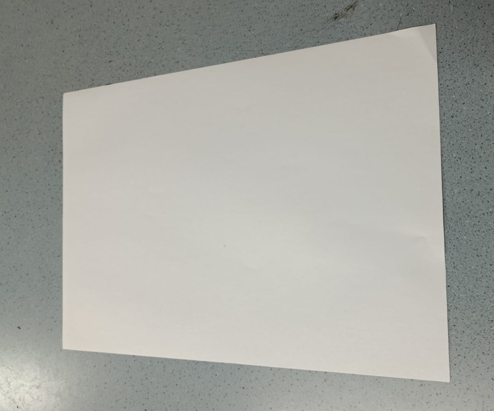
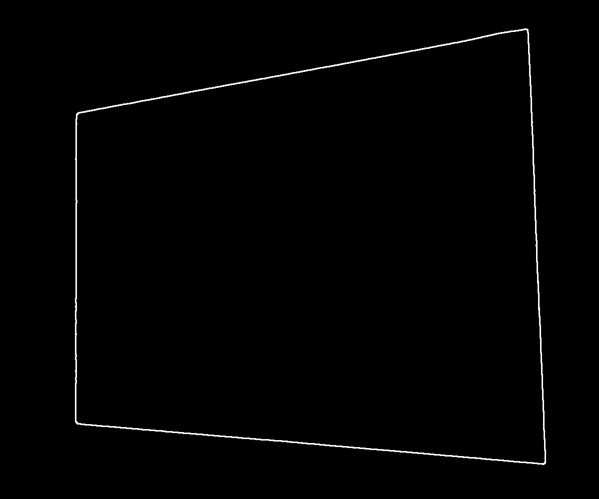
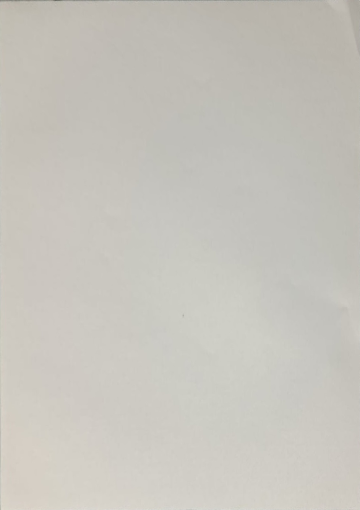

# Document Scanner with Perspective Correction (OpenCV & Python)

## Project Overview
This pipeline converts a tilted, perspective-distorted photo into a clean A4-aligned scanned document.

This project establishes a robust document scanning pipeline using Python and OpenCV. It is designed to process smartphone-captured, perspective-distorted document photos, automatically cleaning and rectifying them to produce a clean, printable output.
The pipeline performs the following core actions:
**Noise Reduction:** The pipeline applies Median Blur for noise reduction because the input images often contain salt-and-pepper noise—a common artifact in smartphone-captured photos.
**Edge Detection:** Employs Canny and Dilation to find and solidify the document's boundaries.
**Smart Detection:** Detects and filters contours by area, using approxPolyDP to mathematically identify the four main corner vertices of the largest shape (the paper).
**Correction Logic:** Mathematically sorts the corners and calculates the true dimensions (width/height) via Euclidean distance.
**Transformation:** Applies the Warp Perspective to flatten the document, explicitly enforcing the standard A4 aspect ratio (1:1.414) for a professional, print-ready scan.

## Installation
Python 3.10+ is recommended to run this project.  

```bash
# Create virtual environment (optional but recommended)
python -m venv .venv
source .venv/bin/activate      # Windows: .venv\Scripts\activate

# Install required packages
pip install -r requirements.txt
```

## Results

The table below shows the full transformation pipeline:
original → noisy edges → cleaned edges → final perspective-corrected output.

| Original Image | Canny Detection (with noise) | Canny + Dilation (cleaned) | Final Output |
|----------------|------------------------------|-----------------------------|--------------|
|  |  |  |  |

## License
This project is licensed under the MIT License - see the [LICENSE](LICENSE) file for details.

## Usage

Run the project by simply executing:

```bash
python main.py
```
